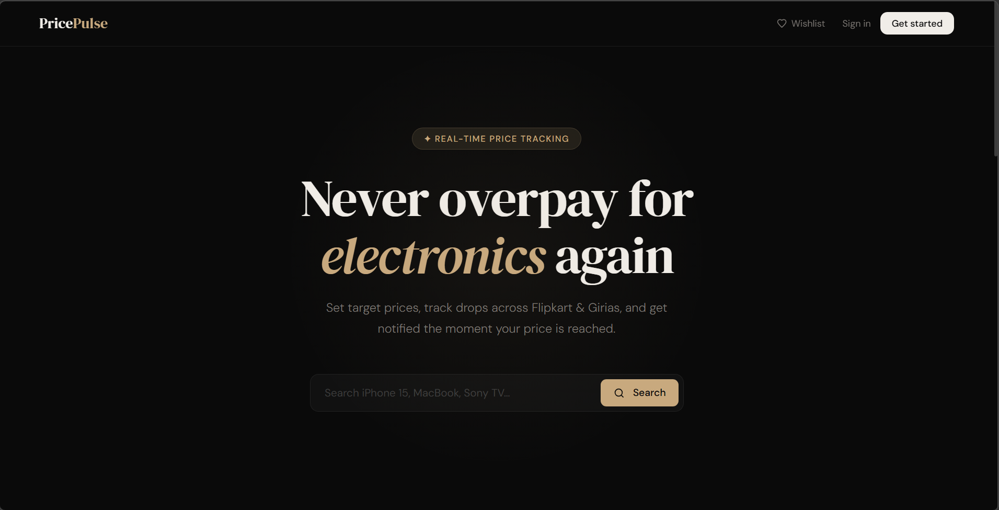
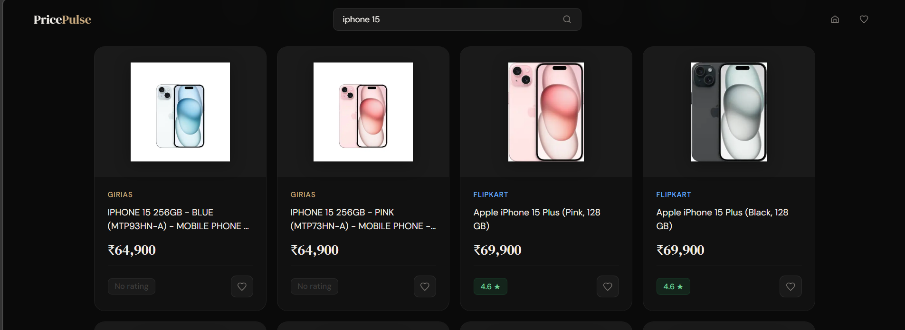
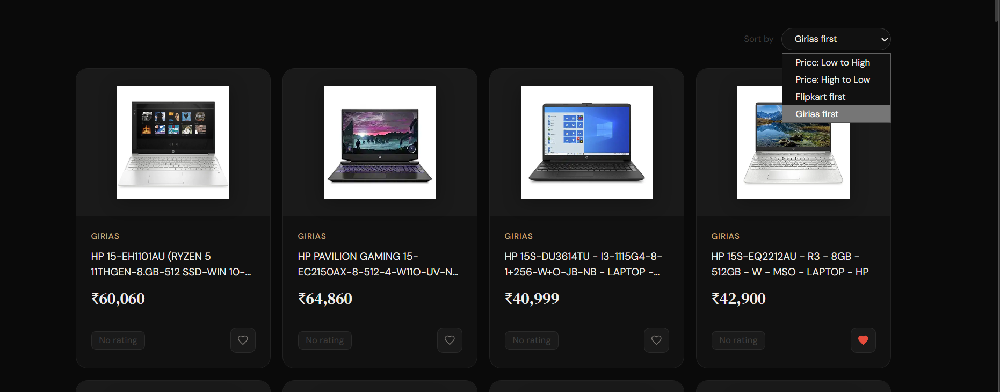
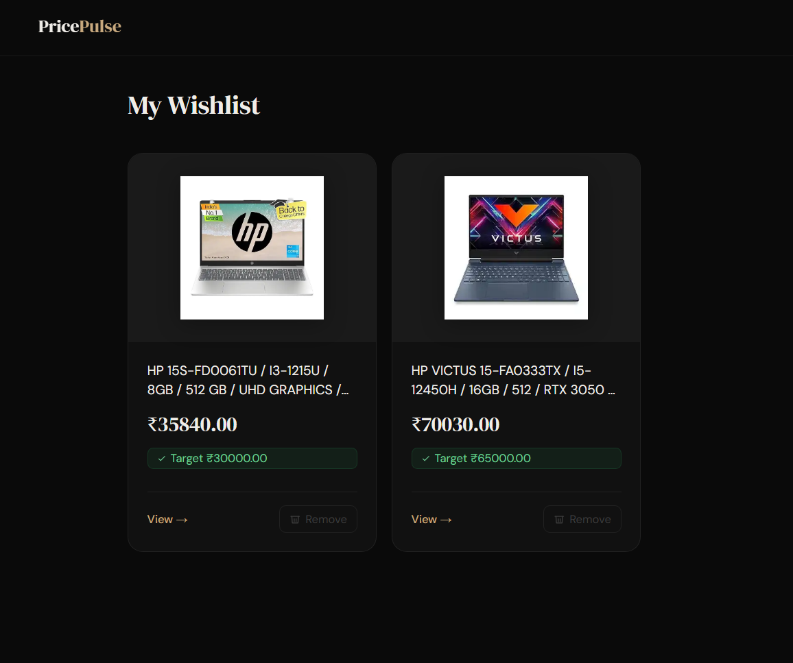

# PricePulse 

Shopping assistant for electronics that aggregates prices from various platforms, allows users to compare products, save to wishlist, set target price notifications, and monitor price trends over time.


## Features

- 🔍 Search products across Flipkart and Girias simultaneously
- 💰 Compare prices side by side
- ❤️ Wishlist with target price setting
- 📧 Email alerts when price drops to your target
- 🔐 OTP verified registration
- 🔑 Google OAuth login

## Screenshots





```


## Tech Stack

- **Backend** — Flask, PostgreSQL, APScheduler
- **Scraping** — Selenium, BeautifulSoup
- **Auth** — Flask-Login, bcrypt, Google OAuth
- **Email** — smtplib (Gmail)

## Setup

1. Clone the repo
```
   git clone <your-repo-url>
   cd smart-shopping-assistant
```

2. Create and activate virtual environment
```
   python -m venv venv
   venv\Scripts\activate
```

3. Install dependencies
```
   pip install -r requirements.txt
```

4. Create a `.env` file with:
```
   SECRET_KEY=your_secret_key
   DB_NAME=pricepulse
   DB_USER=postgres
   DB_PASSWORD=your_password
   DB_HOST=localhost
   DB_PORT=5432
   GMAIL=your_gmail
   GMAIL_PASSWORD=your_app_password
   GOOGLE_CLIENT_ID=your_google_client_id
```

5. Run the app
```
   python app.py
```


## Project Structure
```
├── routes/          # Auth, wishlist, profile, OTP routes
├── scrapers/        # Flipkart and Girias scrapers
├── services/        # Auth, wishlist, email, price checker
├── static/          # CSS and JS files
├── templates/       # HTML templates
├── app.py           # Main Flask app
└── database.py      # DB connection and schema
```